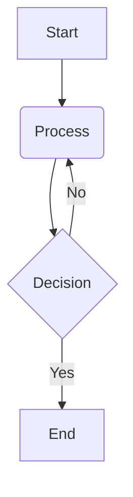

# Feature Specification: Humanoid Robotics & Physical AI Book

**Feature Branch**: `1-book-spec`
**Created**: 2025-12-03
**Status**: Draft
**Input**: User description: "You are SpecKit+ operating together with Claude Code Router, Gemini CLI, and Context7 MCP tools.
Your task is to generate a complete Specification Document for the book project
“Humanoid Robotics & Physical AI” with UI rendering powered by Docusaurus.

### 🧩 Purpose of This Specification
This specification must define:
- Book architecture
- Content modules
- UI structure for Docusaurus documentation website
- Interaction flow using Context7 MCP tools
- Technical + non-technical requirements
- Writing constraints and quality standards

### 📘 Book Content Specification
Your output must define:

1. **Chapter Breakdown**
   - 15–20 chapters
   - Each chapter must list:
     - Main objectives
     - Learning outcomes
     - Subsections
     - Required diagrams
     - Required examples/case studies
     - Required code blocks (Python, ROS2, simulation)

2. **Content Types**
   - Theory sections
   - Practical implementations
   - Callout boxes (Tips, Notes, Cautions)
   - Glossary entries
   - Exercises + quizzes

3. **Technical Depth**
   Include levels:
   - Beginner → Intermediate → Advanced
   - Embedded systems (sensors, actuators)
   - Robotics control systems & kinematics
   - Physical AI, reinforcement learning, embodied cognition
   - Real-world robots (Tesla Optimus, Boston Dynamics)
   - Simulation (Gazebo, MuJoCo, Isaac Gym)

### 🎨 Docusaurus UI / UX Specification
Define a full Docusaurus documentation structure:

- `/docs/introduction`
- `/docs/humanoid-design`
- `/docs/robot-mechanics`
- `/docs/sensors-actuators`
- `/docs/control-systems`
- `/docs/ai-and-embodiment`
- `/docs/case-studies`
- `/docs/code-examples`
- `/docs/diagrams`
- `/docs/appendix`

For each route specify:
- Sidebar title
- Page layout
- UI blocks (MDX)/
- Components to use (Tabs, Admonitions, Code Blocks)
- Navigation flow
- Search integration

### 🛠️ Context7 MCP Tool Integration Specification
Clearly define how Context7 MCP tools will be used in this book creation workflow:
- For generating chapter files
- Managing version control of markdown files
- Creating UI pages automatically
- Running background tasks (build, previews)
- Handling user interactions in real time
- Validating structure & consistency

### 🔧 System Rules
- Use Markdown + MDX (for Docusaurus)
- Maintain consistent style & formatting
- Every chapter must be modular and independently renderable
- Produce only validated sections (no hallucinations)
- Claude Router handles reasoning
- Gemini CLI handles robotics facts, diagrams, formulas
- SpecKit merges both correctly

### 📦 Final Output of sp.spec
Produce a **complete, structured, multi-section Specification Document** including:

1. Overview
2. Scope
3. Functional Requirements
4. Non-Functional Requirements
5. Docusaurus UI Structure
6. File/Folder Structure
7. Chapter Module Specifications
8. Context7 MCP Workflow
9. Writing Guidelines
10. Deliverables & Acceptance Criteria

Format everything in clean Markdown for Docusaurus UI."

## 1. Overview

This document specifies the architecture, content modules, UI structure, and workflow for the "Humanoid Robotics & Physical AI" book project. The book will be rendered as a Docusaurus documentation website, leveraging Claude Code Router, Gemini CLI, and Context7 MCP tools for collaborative content creation and management.

## 2. Scope

**In Scope**:
- Generation of 15-20 book chapters covering humanoid robotics fundamentals, design, mechanics, kinematics, physical AI, sensors, actuators, control systems, reinforcement learning, imitation learning, embodied cognition, real-world case studies (e.g., Tesla Optimus, Boston Dynamics Atlas), simulation (e.g., Gazebo, MuJoCo, Isaac Gym), safety, ethics, governance, and the future of physical AI.
- Specification of content types including theory, practical implementations, callout boxes, glossary entries, exercises, and quizzes.
- Definition of technical depth from Beginner to Advanced levels.
- Design of a Docusaurus UI/UX structure with specified routes, sidebar titles, page layouts, MDX blocks, components (Tabs, Admonitions, Code Blocks), navigation flow, and search integration.
- Integration of Context7 MCP tools for chapter file generation, version control, UI page creation, background tasks (build, previews), real-time user interactions, and structural validation.
- Content creation using Markdown and MDX.

**Out of Scope**:
- Live deployment and hosting infrastructure for the Docusaurus website (beyond local previews).
- User management or authentication within the Docusaurus site itself.
- Deep, real-time interactive simulations embedded directly within the Docusaurus pages (focus on static code examples and diagrams).
- The default audience for the book is assumed to be technical professionals, researchers, and advanced students in robotics, AI, and related engineering fields.

## 3. Functional Requirements

### Book Content Specification
- **FR-001**: The book MUST consist of 15-20 chapters.
- **FR-002**: Each chapter MUST include: main objectives, learning outcomes, subsections, required diagrams, required examples/case studies, and required code blocks (Python, ROS2, simulation).
- **FR-003**: The book MUST incorporate diverse content types: theory sections, practical implementations, callout boxes (Tips, Notes, Cautions), glossary entries, exercises, and quizzes.
- **FR-004**: The book MUST address technical depth across Beginner, Intermediate, and Advanced levels, covering embedded systems (sensors, actuators), robotics control systems & kinematics, physical AI, reinforcement learning, imitation learning, embodied cognition, real-world robots (Tesla Optimus, Boston Dynamics), and simulation environments (Gazebo, MuJoCo, Isaac Gym).

### Docusaurus UI / UX Functionality
- **FR-005**: The Docusaurus site MUST include specified routes: `/docs/introduction`, `/docs/humanoid-design`, `/docs/robot-mechanics`, `/docs/sensors-actuators`, `/docs/control-systems`, `/docs/ai-and-embodiment`, `/docs/case-studies`, `/docs/code-examples`, `/docs/diagrams`, `/docs/appendix`.
- **FR-006**: Each Docusaurus route MUST have a defined sidebar title.
- **FR-007**: Each Docusaurus page MUST support specified page layouts and UI blocks (MDX components like Tabs, Admonitions, Code Blocks).
- **FR-008**: The Docusaurus site MUST provide clear navigation flow between chapters and sections.
- **FR-009**: The Docusaurus site MUST integrate search functionality for easy content discovery.

### Context7 MCP Tool Integration
- **FR-010**: Context7 MCP tools MUST be used for generating individual chapter files.
- **FR-011**: Context7 MCP tools MUST manage version control of all Markdown and MDX files.
- **FR-012**: Context7 MCP tools MUST facilitate automatic creation of Docusaurus UI pages.
- **FR-013**: Context7 MCP tools MUST run background tasks, including Docusaurus build and preview processes.
- **FR-014**: Context7 MCP tools MUST handle real-time user interactions within the book creation workflow.
- **FR-015**: Context7 MCP tools MUST validate the structural and content consistency of the book.

## 4. Non-Functional Requirements

### Quality Standards
- **NFR-001**: All book content and Docusaurus output MUST adhere to clean, uniform Markdown and MDX formatting.
- **NFR-002**: A consistent writing style and formatting MUST be maintained across all chapters.
- **NFR-003**: Every chapter MUST be modular and independently renderable within the Docusaurus framework.
- **NFR-004**: Content generation MUST produce only validated sections, free from hallucinations (Claude Router for reasoning, Gemini CLI for factual accuracy, diagrams, formulas).
- **NFR-005**: The SpecKit system MUST correctly merge outputs from Claude Router and Gemini CLI to ensure high-quality content.

### Performance
- **NFR-006**: The Docusaurus site SHOULD load chapter content rapidly, aiming for a p95 latency of under 1 second for page loads.
- **NFR-007**: The build process for the Docusaurus site SHOULD complete within a reasonable timeframe (e.g., under 5 minutes for incremental builds).

### Maintainability
- **NFR-008**: The Docusaurus project structure and configuration MUST be clear and well-documented to facilitate future updates and maintenance.

## 5. Docusaurus UI Structure

The Docusaurus documentation will reside under the `/docs/` directory, with the following initial structure:

- **`/docs/introduction.mdx`**:
    - **Sidebar Title**: Introduction
    - **Page Layout**: `default`
    - **UI Blocks**: Standard Markdown, Code Blocks
    - **Components**: N/A
    - **Navigation Flow**: First chapter in the main navigation.
    - **Search Integration**: Fully searchable content.

- **`/docs/humanoid-design.mdx`**:
    - **Sidebar Title**: Humanoid Design
    - **Page Layout**: `default`
    - **UI Blocks**: Standard Markdown, Diagrams (Mermaid/ASCII), Images
    - **Components**: Tabs (for design variations), Admonitions (for design principles).
    - **Navigation Flow**: Follows Introduction.
    - **Search Integration**: Fully searchable content.

- **`/docs/robot-mechanics.mdx`**:
    - **Sidebar Title**: Robot Mechanics
    - **Page Layout**: `default`
    - **UI Blocks**: Standard Markdown, Formulas (MathJax/KaTeX integration), Diagrams, Code Blocks (kinematics calculations).
    - **Components**: Code Blocks, Admonitions.
    - **Navigation Flow**: Follows Humanoid Design.
    - **Search Integration**: Fully searchable content.

- **`/docs/sensors-actuators.mdx`**:
    - **Sidebar Title**: Sensors & Actuators
    - **Page Layout**: `default`
    - **UI Blocks**: Standard Markdown, Images, Tables, Code Blocks (interface examples).
    - **Components**: Tabs (for different sensor types), Admonitions (for best practices).
    - **Navigation Flow**: Follows Robot Mechanics.
    - **Search Integration**: Fully searchable content.

- **`/docs/control-systems.mdx`**:
    - **Sidebar Title**: Control Systems
    - **Page Layout**: `default`
    - **UI Blocks**: Standard Markdown, Diagrams (control loops), Formulas, Code Blocks (PID controllers, state-space models).
    - **Components**: Code Blocks, Tabs (for different control strategies).
    - **Navigation Flow**: Follows Sensors & Actuators.
    - **Search Integration**: Fully searchable content.

- **`/docs/ai-and-embodiment.mdx`**:
    - **Sidebar Title**: AI & Embodiment
    - **Page Layout**: `default`
    - **UI Blocks**: Standard Markdown, Diagrams (RL architectures), Case Studies.
    - **Components**: Admonitions, Code Blocks (RL examples).
    - **Navigation Flow**: Follows Control Systems.
    - **Search Integration**: Fully searchable content.

- **`/docs/case-studies.mdx`**:
    - **Sidebar Title**: Case Studies
    - **Page Layout**: `default`
    - **UI Blocks**: Standard Markdown, Images, Videos (links), Tables comparing robots.
    - **Components**: Tabs (for different robots), Admonitions (for key takeaways).
    - **Navigation Flow**: Integrates real-world examples.
    - **Search Integration**: Fully searchable content.

- **`/docs/code-examples.mdx`**:
    - **Sidebar Title**: Code Examples
    - **Page Layout**: `default`
    - **UI Blocks**: Code Blocks (Python, ROS2, simulation), explanatory text.
    - **Components**: Tabs (for different languages/frameworks), Code Blocks with highlighting.
    - **Navigation Flow**: Centralized repository of all code samples.
    - **Search Integration**: Fully searchable content.

- **`/docs/diagrams.mdx`**:
    - **Sidebar Title**: Diagrams
    - **Page Layout**: `default`
    - **UI Blocks**: Images, Mermaid diagrams, ASCII art diagrams.
    - **Components**: N/A (primarily visual content).
    - **Navigation Flow**: Reference section for visual aids.
    - **Search Integration**: Searchable by diagram captions/descriptions.

- **`/docs/appendix.mdx`**:
    - **Sidebar Title**: Appendix
    - **Page Layout**: `default`
    - **UI Blocks**: Glossary, bibliography, additional resources.
    - **Components**: N/A
    - **Navigation Flow**: Concluding section.
    - **Search Integration**: Fully searchable content.

## 6. File/Folder Structure

```
├── .specify/
├── docs/
│   ├── introduction.mdx
│   ├── humanoid-design.mdx
│   ├── robot-mechanics.mdx
│   ├── sensors-actuators.mdx
│   ├── control-systems.mdx
│   ├── ai-and-embodiment.mdx
│   ├── case-studies.mdx
│   ├── code-examples.mdx
│   ├── diagrams.mdx
│   ├── appendix.mdx
│   └── _category_.json (for sidebar configuration)
├── specs/
│   └── 1-book-spec/
│       └── spec.md
│       └── checklists/
│           └── requirements.md
├── src/components/ (for custom Docusaurus MDX components)
├── docusaurus.config.js
└── package.json
```

## 7. Chapter Module Specifications

Each chapter will be a modular MDX file within the `docs/` directory.

### Chapter Structure:
```markdown
---
sidebar_position: [NUMBER]
sidebar_label: "[Chapter Title]"
---

# [Chapter Title]

## Objectives
- [Objective 1]
- [Objective 2]

## Learning Outcomes
- [Learning Outcome 1]
- [Learning Outcome 2]

## Subsections
### [Subsection 1 Title]
[Content for subsection 1]

#### Diagrams

_Figure 1: [Diagram Description]_

#### Examples/Case Studies
**Case Study: [Relevant Robot/Scenario]**
[Description and analysis]

#### Code Blocks
```python
# Python example code
def hello_robot():
    print("Hello, Humanoid!")
```

## Summary
[Concise summary of the chapter's key points]

## Key Terms
- [Term 1]: [Definition]
- [Term 2]: [Definition]

## Practical Exercises
1. [Exercise 1 description]
2. [Exercise 2 description]
```

### Content Types:
- **Theory Sections**: Standard Markdown.
- **Practical Implementations**: Markdown with embedded code blocks, step-by-step guides.
- **Callout Boxes**: Use Docusaurus Admonitions (e.g., `:::tip`, `:::note`, `:::caution`).
- **Glossary Entries**: Markdown definitions, potentially a dedicated glossary page in Appendix.
- **Exercises + Quizzes**: Markdown lists, primarily with simple text answers.

## 8. Context7 MCP Workflow

Context7 MCP tools will orchestrate the book creation workflow:

- **Generating Chapter Files**: Context7 will initiate the creation of new chapter MDX files based on the defined `Chapter Module Specifications` and `Docusaurus UI Structure`.
- **Version Control**: Context7 will monitor and manage Git operations (commits, branches, merges) for all content files (`.mdx`, `.md`), ensuring consistency and traceability.
- **Automatic UI Page Creation**: Upon creation or modification of chapter files, Context7 will trigger Docusaurus to generate/update the corresponding UI pages and navigation.
- **Background Tasks**: Context7 will run Docusaurus build processes to generate static site previews and identify any rendering errors. It will also manage local development server (`docusaurus start`).
- **Real-time User Interactions**: Context7 will provide a feedback loop for authors, e.g., linting MDX, previewing changes instantly.
- **Validating Structure & Consistency**: Context7 will enforce the defined content structure, chapter count (15-20), and technical depth requirements. It will flag inconsistencies or non-adherence to writing guidelines.

## 9. Writing Guidelines

- **Style**: Clear, concise, engaging, high-level technical textbook + friendly guide.
- **Progression**: Simple explanations first, then advanced breakdowns.
- **Modularity**: Chapters are independent and renderable.
- **Accuracy**: No hallucinations; factual verification by Gemini CLI for robotics/AI.
- **Formatting**: Clean, uniform Markdown and MDX.
- **Chapter Endings**: Each chapter concludes with a Summary, Key Terms, and Practical Exercises.
- **AI Collaboration**: Claude Router for reasoning, planning, theoretical explanations, structure, editing. Gemini CLI for factual accuracy, robotics physics, formulas, diagrams, examples. SpecKit for blending outputs.

## 10. Deliverables & Acceptance Criteria

### Deliverables
- A complete "Humanoid Robotics & Physical AI" book, comprising 15-20 chapters, formatted in Markdown/MDX.
- All specified figures, diagrams (ASCII or Mermaid), and architecture blueprints.
- Example code blocks in Python, ROS2, and simulation environments.
- A functional Docusaurus website rendering the book content, adhering to the specified UI/UX structure and navigation.
- Glossary, appendix, and bibliography sections.
- `history/prompts/` and `history/adr/` directories populated with relevant records.

### Acceptance Criteria
- **AC-001**: The Docusaurus site successfully builds without errors, and all specified routes are accessible.
- **AC-002**: All 15-20 chapters are present, each following the defined `Chapter Module Specifications` (objectives, outcomes, subsections, diagrams, examples, code, summary, key terms, exercises).
- **AC-003**: Content types (theory, practical, callouts, glossary, exercises) are correctly implemented and rendered.
- **AC-004**: Technical depth (Beginner to Advanced) is evident across chapters for embedded systems, robotics control, physical AI, real-world robots, and simulation.
- **AC-005**: The Docusaurus UI/UX elements (sidebar titles, page layouts, MDX components, navigation, search) function as specified.
- **AC-006**: Context7 MCP tools demonstrate their ability to generate chapters, manage version control, create UI pages, run background tasks, handle user interactions, and validate consistency.
- **AC-007**: All content adheres to the `Writing Guidelines` (style, progression, modularity, accuracy, formatting, chapter endings).
- **AC-008**: No outstanding `[NEEDS CLARIFICATION]` markers remain in the specification document.
- **AC-009**: The book provides an accurate, modern, deeply researched, and easy-to-understand account of Humanoid Robotics & Physical AI.
- **AC-010**: The combined output from Claude Router and Gemini CLI, blended by SpecKit, results in coherent and high-quality content.

## Key Entities

- **Chapter**: A modular unit of the book content, represented as an MDX file. Contains objectives, learning outcomes, subsections, diagrams, examples, code, summary, key terms, and exercises.
- **Book**: The complete collection of 15-20 chapters, rendered as a Docusaurus website.
- **Docusaurus Site**: The web-based UI for the book, generated from MDX content.
- **Context7 MCP Tool**: The orchestration layer for content generation, version control, UI creation, and validation.
- **Claude Code Router**: AI component responsible for deep reasoning, chapter planning, theoretical explanations, structure, and editing.
- **Gemini CLI**: AI component responsible for factual accuracy, robotics physics, formulas, diagrams, and examples.
- **SpecKit**: The integration layer responsible for blending outputs from Claude and Gemini into consistent, high-quality content.

## Assumptions

- A functional Docusaurus environment is assumed to be available for local development and preview.
- All necessary Docusaurus plugins and configurations for MDX, code highlighting, math rendering, and search will be set up.
- Access to Claude Code Router and Gemini CLI via Context7 MCP tools is assumed to be fully operational.
- The default audience for the book is assumed to be technical professionals, researchers, and advanced students in robotics, AI, and related engineering fields.
- The definition of "real-time user interactions" for Context7 MCP tools refers to immediate feedback and automated actions within the content creation workflow, not real-time user interaction with the final Docusaurus book itself.
